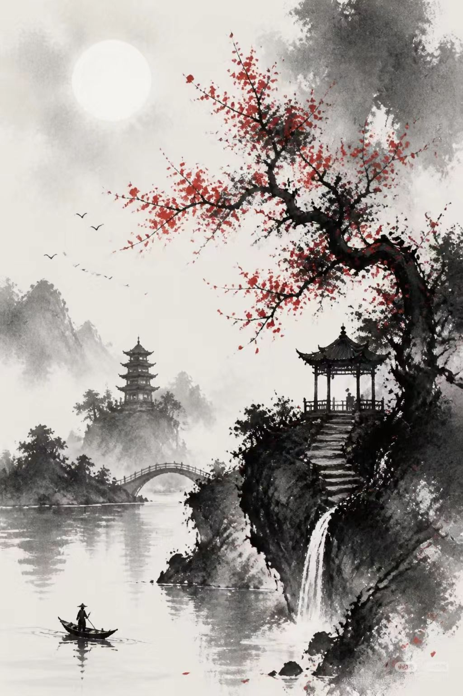
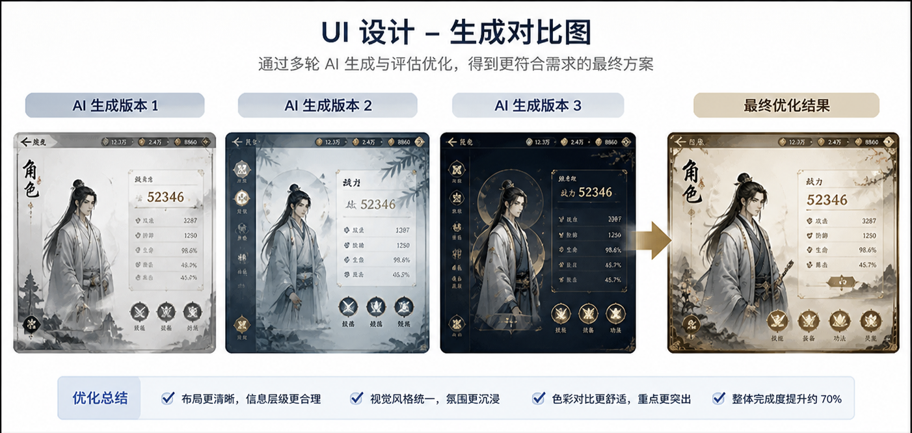
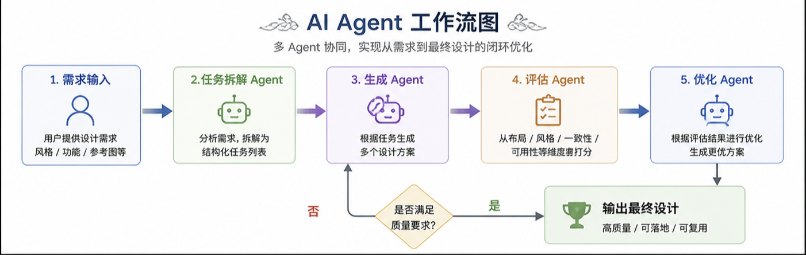

🎮 AI Agent Workflow for Game UI Design

A structured multi-agent workflow for automating game UI and visual asset production.

🚀 What I Did

Built an AI Agent workflow (Task / Generate / Evaluate / Refine)

Applied it to game UI design (Chinese ink style)

Generated multiple UI versions and refined to final output

🧠 Workflow

User Input
↓
Task Agent
↓
Generation
↓
Evaluation
↓
Refinement
↓
Final Output

## 🖼 My Work

### UI Design

---

### Before vs After

---

### Workflow
## 🖼 My Work

### UI Design

---

### Before vs After

---

### Workflow

📊 Results

3–5x faster than traditional design

Multiple design options generated

Higher final quality after refinement

📬 Contact

your@email.com
